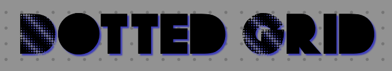
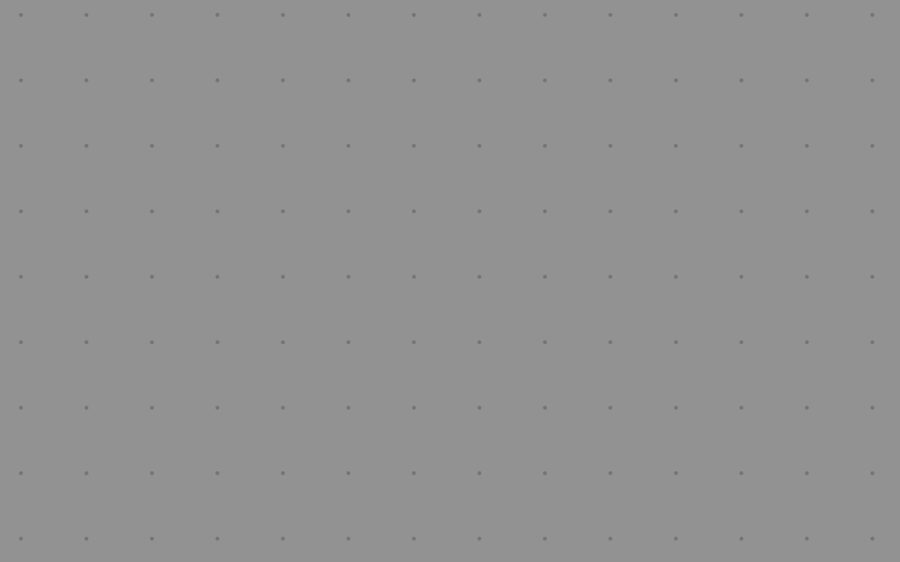

<h1 align="center">Dotted Grid</h1>

  

  Finally have a dotted grid in your games!  
  A simple & light Foundry VTT module.

  

## How to use
When editing a scene, select the "Dotted" grid type and that's it!

### Extra features
- The dots are antialiased to prevent jagged edges. The antialiasing quality depends on the client Performance Mode
(customizable in the core foundry settings), so it can run with high quality on powerful machines and smoothly even on potato PCs and .
- If you wish to edit the dots size, you can use a script macro with `game.dottedGrid.setRadius(<radius>)`. For example `game.dottedGrid.setRadius(3)` is the default value.

## License
See [LICENSE](https://github.com/ClipplerBlood/dotted-grid/blob/master/LICENSE)

